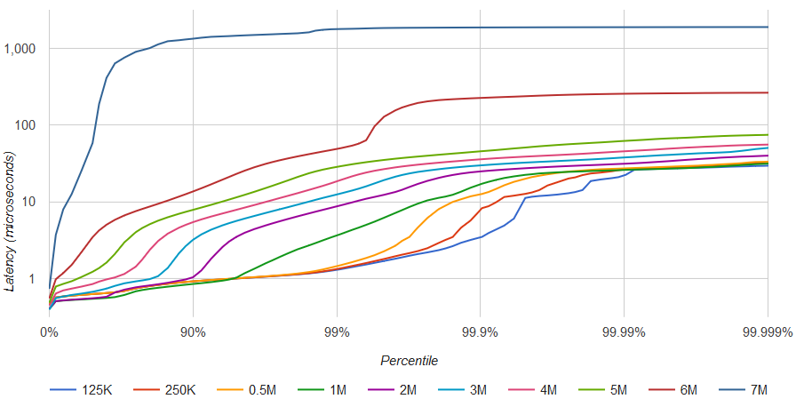

<b> match-engine-core <i>High-performance digital currency, foreign exchange, stock trading, and spot matching engine</i></b>

----

# 撮合系统
> [English](README_en-US.md) | 中文

高性能的数字货币、外汇、股票交易、现货的撮合引擎

# 功能清单：

- 1、支持多种交易策略：FOK、FAK、GTC
- 2、丰富的开放接口，方便快速接入主流的支付系统和快速开发
- 3、灵活的参数配置能力，各种交易参数配置实时生效
- 4、稳定的架构，支持高并发以及横向扩展

# 撮合结构设计：

<table>
  <tr>
     <td></td>
  </tr>
  <tr>
     <td></td>
  </tr>
</table>

# 主要技术指标：

Exchange-core is an **open source market exchange core** based on
[LMAX Disruptor](https://github.com/LMAX-Exchange/disruptor),
[Eclipse Collections](https://www.eclipse.org/collections/) (ex. Goldman Sachs GS Collections),
[Real Logic Agrona](https://github.com/real-logic/agrona),
[OpenHFT Chronicle-Wire](https://github.com/OpenHFT/Chronicle-Wire),
[LZ4 Java](https://github.com/lz4/lz4-java),
and [Adaptive Radix Trees](https://db.in.tum.de/~leis/papers/ART.pdf).

Exchange 核心包括：
- 订单匹配引擎
- 风险控制与会计模块
- 磁盘日志和快照模块
- 交易、管理和报告 API

专为高负载条件下的高可扩展性和不间断 24/7 操作而设计，并提供低延迟响应：
- 300万用户总共拥有1000万个账户
- 100K 订单簿（符号），总计 400 万个挂单
- 每秒 1M+ 操作吞吐量的最差线对线目标延迟小于 1 毫秒
- 大额市价单每次撮合时间为150ns

单一订单簿配置能够在 10 年旧硬件（英特尔® 至强® X5690）上每秒处理 500 万次操作，且延迟程度适中：

|rate|50.0%|90.0%|95.0%|99.0%|99.9%|99.99%|worst|
|----|-----|-----|-----|-----|-----|------|-----|
|125K|0.6µs|0.9µs|1.0µs|1.4µs|4µs  |24µs  |41µs |
|250K|0.6µs|0.9µs|1.0µs|1.4µs|9µs  |27µs  |41µs |
|500K|0.6µs|0.9µs|1.0µs|1.6µs|14µs |29µs  |42µs |
|  1M|0.5µs|0.9µs|1.2µs|4µs  |22µs |31µs  |45µs |
|  2M|0.5µs|1.2µs|3.9µs|10µs |30µs |39µs  |60µs |
|  3M|0.7µs|3.6µs|6.2µs|15µs |36µs |45µs  |60µs |
|  4M|1.0µs|6.0µs|9µs  |25µs |45µs |55µs  |70µs |
|  5M|1.5µs|9.5µs|16µs |42µs |150µs|170µs |190µs|
|  6M|5µs  |30µs |45µs |300µs|500µs|520µs |540µs|
|  7M|60µs |1.3ms|1.5ms|1.8ms|1.9ms|1.9ms |1.9ms|

### 基准配置：
- 单一符号订单簿。
- 3,000,000 条入站消息分布如下：9% GTC 订单、3% IOC 订单、6% 取消命令、82% 移动命令。 大约 6% 的消息会触发一笔或多笔交易。
- 1,000 个活跃用户帐户。
- 平均约 1,000 个限价订单处于活跃状态，放置在约 750 个不同的价格段中。
- 延迟结果仅用于风险处理和订单匹配。 不包括网络接口延迟、IPC、日志等其他内容。
- 测试数据不是突发的，这意味着命令之间的间隔恒定（0.2~8μs，取决于目标吞吐量）。
- BBO 价格在整个测试过程中没有发生显着变化。 没有雪崩订单。
- 延迟基准没有协调遗漏效应。 任何处理延迟都会影响后续消息的测量。
- GC 在运行每个基准周期（3,000,000 条消息）之前/之后触发。
- RHEL 7.5，网络延迟调整 adm 配置文件，双 X5690 6 核 3.47GHz，一个插槽隔离且无滴答，禁用幽灵/熔毁保护。

### 特征
- 高频交易优化。 优先级是限价指令移动操作的平均延迟（目前约为 0.5μs）。 取消操作约 0.7μs，下新订单约 1.0μs；
- 会计数据和订单簿的内存工作状态。
- 事件源 - 磁盘日志记录和日志重放支持、状态快照（序列化）和恢复操作、LZ4 压缩。
- 无锁、无争用的订单匹配和风控算法。
- 没有浮点运算，不会丢失重要性。
- 匹配引擎和风险控制操作是原子性和确定性的。
- 流水线多核处理（基于LMAX Disruptor）：每个CPU核心负责特定的处理阶段、用户账户分片或交易品种订单分片。
- 两种不同的风险处理模式（按符号指定）：直接交易和保证金交易。
- 挂单者/接受者费用（以报价货币单位定义）。
- 两种订单簿实施：简单实施（“Naive”）和绩效实施（“Direct”）。
- 订单类型：立即或取消 (IOC)、取消前有效 (GTC)、填写或取消预算 (FOK-B)
- 测试 - 单元测试、集成测试、压力测试、完整性/一致性测试。
- 低 GC 压力、对象池、单环形缓冲区。
- 线程关联性（需要 JNA）。
- 用户挂起/恢复操作（减少内存消耗）。
- 核心报告 API（用户余额、未平仓合约）。

